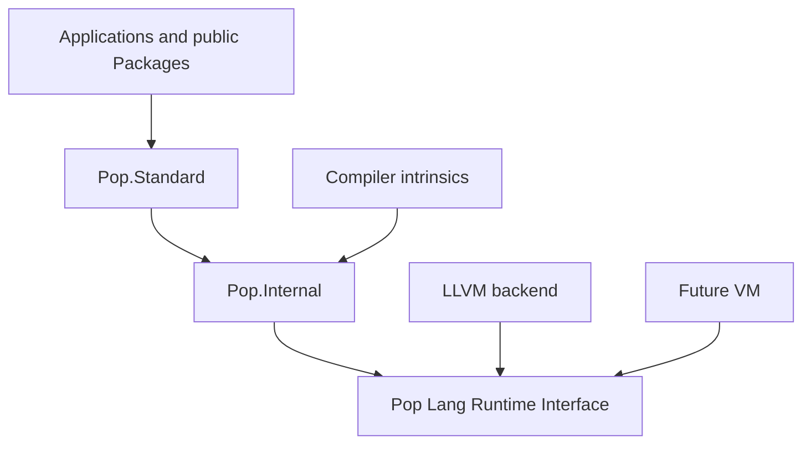

# Base Libraries

## Objective

Pop Lang ships exactly two reserved foundational library Bubbles:

| Bubble | Visibility | Purpose |
| --- | --- | --- |
| `Pop.Internal` | compiler/runtime only | intrinsic types, GC/runtime bridges, and backend-neutral low-level primitives |
| `Pop.Standard` | public | native Pop values, protocols, and portable foundation APIs |

`Pop.Standard` cannot depend on compiler implementation packages.
`Pop.Internal` cannot depend on `Pop.Standard`. User code cannot directly
reference `Pop.Internal`. Optional official and platform Packages are not
foundational Bubbles and are never referenced implicitly.

The complete public scope, package tiers, names, costs, examples, and delivery
plan are defined by [Public standard-library architecture](./22-public-standard-library-architecture.md).

## Shared principles

- All runtime operations have compiler-proven types; neither library exposes
  dynamic values, string dispatch, or unrestricted reflection.
- Expected failures use typed `Result<T, TError>` values. Absence uses `T?`.
- HIR and MIR see backend-neutral semantic identities, never native ABI names.
- Public APIs prefer values, records, unions, functions, views, iterators,
  streams, explicit capabilities, and real opaque resource handles.
- Common public calls are short and direct. Advanced control uses typed option
  records, buffers, streams, and scopes rather than builders or service graphs.
- Public documentation states allocation, ownership/copying, blocking or
  suspension, dispatch, native transitions, complexity, security limits, and
  target availability where relevant.
- Runtime/platform differences are behind PLRI or explicit platform Packages;
  they do not create backend-specific HIR/MIR semantics.
- Public source and documentation follow the canonical naming rules and checked
  XML documentation contract.

## `Pop.Internal`

### Identity and trust

`Pop.Internal` is a trusted library Bubble/`.poplib` selected by the toolchain.
Its manifest is bound to a compatible compiler edition and PLRI ABI. It cannot
be supplied, replaced, or referenced through an ordinary Package dependency.

The loader verifies:

- reserved Bubble identity and toolchain signature/content hash;
- compiler, runtime, intrinsic-table, and PLRI compatibility;
- target capability requirements;
- reference and implementation metadata integrity.

A mismatch is a toolchain incident, not a suppressible user diagnostic.

### Responsibilities

`Pop.Internal` owns only trusted mechanisms:

- primitive storage and operations required before normal library binding;
- intrinsic declarations and stable semantic IDs/signature hashes;
- precise GC allocation, roots, barriers, pins, safe points, and panic/unwind
  transitions;
- coroutine/task runtime transitions authorized by async architecture;
- PLRI adapters for clocks, I/O, processes, threads, networking, entropy, and
  native interop;
- verified helpers whose unchecked preconditions were proved by the compiler;
- bootstrap-only declarations needed to build the normal libraries.

It does not own public policy, convenience algorithms, formatting, codecs,
locale behavior, protocol frameworks, public metadata models, or application
services. A public-library decision may document its dependency on a private
mechanism, but it does not make that mechanism public.

### Intrinsic binding

Compiler and library binding uses versioned semantic identities and exact
signature hashes, not source spelling. Each intrinsic records:

- stable ID, semantic edition, and complete static signature;
- effects, failure/trap behavior, GC/safe-point behavior, and capability needs;
- portable managed body or PLRI/runtime entry;
- required compiler proof for any unchecked operation.

The compiler rejects missing, duplicated, incompatible, or target-unavailable
intrinsics before user analysis. Backends consume the same HIR/MIR operation;
they cannot independently reinterpret the intrinsic.

### Primitive ownership

Source-visible primitive names and semantics are public language contracts.
Their bootstrap storage and runtime hooks may live in `Pop.Internal` without
making the private Bubble a source-level owner. There is no universal `Object`
root, boxed dynamic fallback, or reflective member protocol.

### Safety rules

- Public code cannot name, import, retain, or serialize `Pop.Internal` symbols.
- Unchecked memory/indexing helpers require a compiler proof or explicit unsafe
  caller contract.
- Internal panic is reserved for violated invariants, not expected failures.
- Private handles cannot escape into public reference metadata.
- Compiler debug builds verify intrinsic signatures and GC/runtime transitions.

### Bootstrap process

1. Load the minimal built-in schema needed to parse and check trusted sources.
2. Build `Pop.Internal` with bootstrap-only intrinsic stubs.
3. Reload and verify its reference/implementation metadata.
4. Link native runtime stubs and portable managed bodies.
5. Build `Pop.Standard` against the verified private reference surface.
6. Rebuild both through the normal pipeline and compare public/intrinsic hashes.

Library algorithms remain normal Pop code whenever that preserves the required
cost, portability, and dependency contracts.

## `Pop.Standard`

### Identity and availability

Every normal project receives one implicit reference to the toolchain-compatible
`Pop.Standard` Bubble and one exact curated prelude from trusted `@Prelude`
declarations. `@Prelude` is accepted only from the verified reserved identity;
user Packages cannot inject global names by copying its spelling.

The prelude is deliberately smaller than the catalog. It contains primitive and
foundation types, `Result`, `Option`, essential collection/iteration protocols,
task/cancellation values once implemented, and a reviewed set of functions and
root aliases. A catalog root is not implicitly available merely because it is
planned. The first exact root list remains an implementation prerequisite in
[the implementation plan](./22.6-standard-library-implementation-plan.md).

Prelude bindings have the lowest resolution priority. Locals, current namespace
declarations, and explicit aliases win. Adding a prelude binding is a public
compatibility change with collision tests and an API-baseline update.

`--no-standard-library` exists only for toolchain/runtime development and
freestanding targets. Unsafe/native surfaces and optional official Packages are
always explicit dependencies/imports.

### Current implementation status

The bootstrap currently provides only:

- stable metadata/protocol identities and primitive/prelude types;
- `print(Int) -> ()` through a trusted standard-function identity;
- prototype checked arithmetic, UTF-8 slicing, and sequence helpers.

These are implementation evidence, not a completed public standard library.
Their migration review is recorded in
[the implementation plan](./22.6-standard-library-implementation-plan.md).

### Public scope and ownership

The active public catalog is split by review domain:

- [core and portable values](./22.1-core-and-portable-library-catalog.md);
- [system, network, and security](./22.2-system-network-security-catalog.md);
- [data, observability, and tooling](./22.3-data-observability-tooling-catalog.md);
- [application, media, and science](./22.4-application-media-science-catalog.md).

`Pop.Standard` owns only entries whose tier includes `standard`. A root may span
a small standard value/protocol contract and separate official/platform
implementations, but Package metadata and documentation must make that boundary
visible. Standard code cannot depend upward on an official or platform Package.

### API and cost review

ADR 0032 is binding. Each public family supplies concise default, advanced, and
efficient stream/view/buffer/resource call sites. Review rejects unnecessary
namespace levels, repeated domain words, long positional parameter lists,
builder chains, manager/provider/service objects, hidden materialization,
ambient authority, and undocumented dispatch/native transitions.

Convenience functions use the same typed primitives available to advanced code.
They may allocate, copy, buffer, suspend, or cross PLRI only when the contract
says so. Numeric performance budgets are accepted only after reproducible
benchmarks; intended cost models remain labeled until measured.

### Errors and resources

- Recoverable failures return domain-specific closed errors through `Result`.
- Cancellation, timeout, permission, unsupported capability, invalid input,
  limits, integrity, and platform failure remain distinguishable.
- Compiler diagnostics are not runtime error values.
- Resource ownership and close behavior are deterministic and documented.
- Finalizers do not provide correctness; cleanup remains explicit/scoped.
- Sync calls do not schedule tasks. Async calls document task allocation,
  suspension, cancellation, cleanup, and backpressure.

### Versioning and availability

- Public reference metadata and checked documentation are diffed in CI.
- Stable removal/narrowing requires an edition/major compatibility process.
- An alias needs an exact semantic replacement and removal plan; aliases do not
  preserve verbose architecture or hide changed costs/security.
- Portable contracts have one semantic meaning across backends.
- Compile-time target requirements reject impossible APIs early; runtime
  capability variation returns typed unsupported outcomes where appropriate.
- Platform extensions live in explicit `Pop.Platform.<Target>` Packages and do
  not pollute portable namespaces.

## Profiles

Profiles select distribution content, not alternate meanings:

- `Standard`: the supported `Pop.Standard` surface for desktop/server targets;
- `Minimal`: an explicitly documented subset for constrained targets;
- `Freestanding`: `Pop.Internal` plus a deliberately selected tiny public
  surface for runtime/toolchain development.

A profile cannot silently change the semantics of an available API. Missing
capabilities are represented in target/package metadata and diagnostics.

## Testing and quality gates

- exact prelude, root inventory, tier, dependency, and API snapshots;
- concise call-site and forbidden-name/shape analyzers;
- allocation, copy, view-lifetime, dispatch, native-transition, and complexity
  fixtures where observable;
- positive, negative, limits, lifecycle, cancellation, portability, and
  security tests per implemented family;
- cross-backend differential tests for every portable semantic contract;
- fault injection and deterministic clocks/transports/randomness;
- parser/protocol fuzzing and adversarial resource-limit corpora;
- no private symbols in public metadata and no inverse base-library dependency;
- complete checked documentation, examples, effects, costs, target matrices,
  migration notes, and benchmarks for stabilized budgets.

## Historical influence boundary

ADR 0030 superseded the earlier BCL-oriented public direction. Mature platform
libraries may be consulted only as capability-coverage checklists. They do not
authorize Pop Lang API shapes, namespaces, object models, naming, or compatibility
promises. ADR 0009 preserves the two-base-library trace; ADRs 0030-0032 and the
section 22 catalog set define the current public contract.
